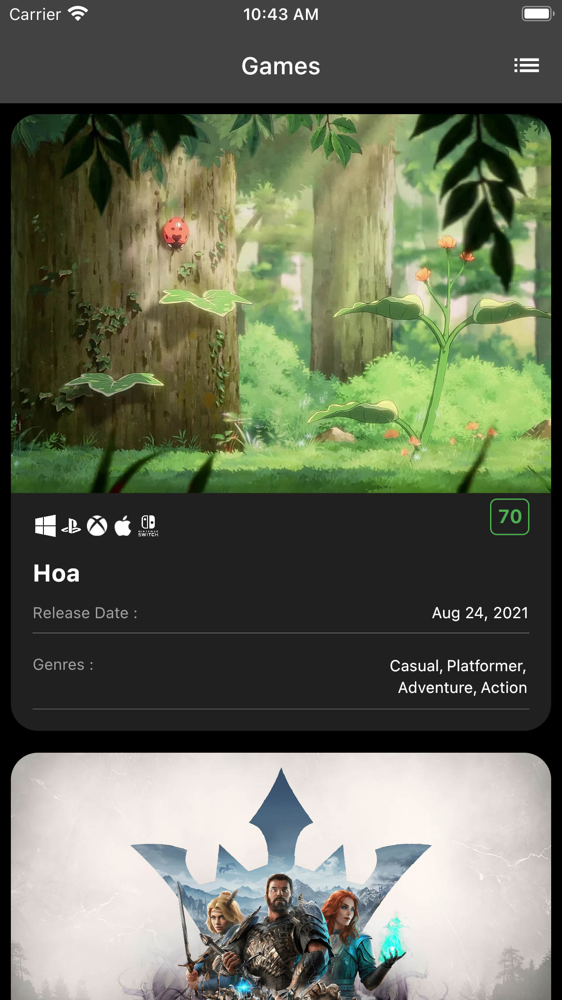
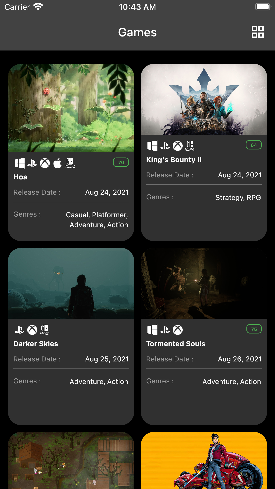
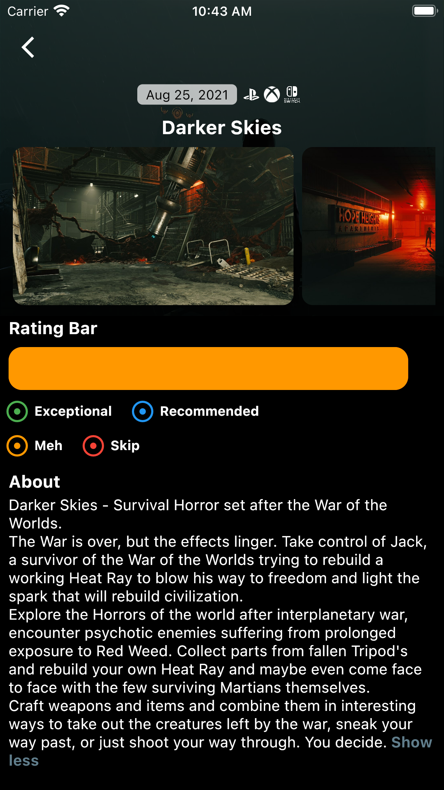

# playstation_game

Application build with Flutter, use RAWG API

## Features

* List View Games Or Grid View Games.
* Detail Game

## Screenshots App

<pre>
        
</pre>

## Built With

* [BLoC Pattern](https://bloclibrary.dev/) - Business logic component to separate the business logic
  with UI.
* [Equatable](https://pub.dev/packages/equatable) - Being able to compare objects in `Dart` often
  involves having to override the `==` operator.
* [Retrofit](https://pub.dartlang.org/packages/retrofit)
  with [Dio](https://github.com/flutterchina/dio/) - A type-safe HTTP client.
* [Json Serializable](https://pub.dev/packages/json_serializable) - Builders for handling JSON.
